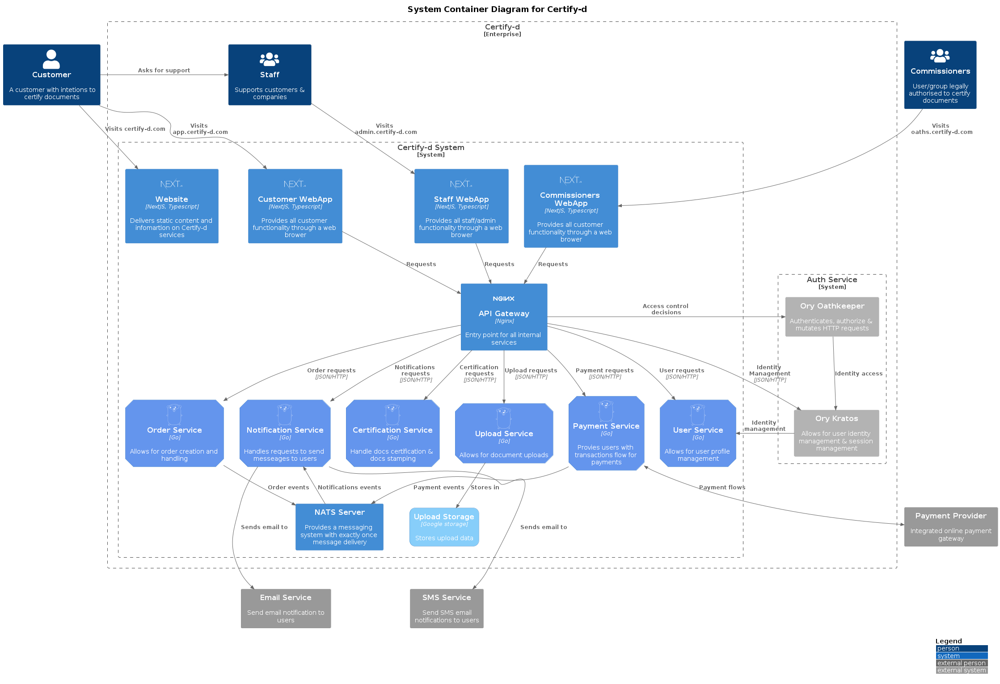

# Architecture Overview

The architectural overview of this project is presented using the [C4 Model](https://c4model.com/L) and [C4 PlantUml](https://github.com/plantuml-stdlib/C4-PlantUML) for the diagrams below.

## Level 1: System Context Diagram

A high-level overview of the system is detailed below. We define person/actors, the system itself, and other (external) systems at play.

- Person/Actors: these are users of our system.
- The System: the system at the highest level of abstraction.
- External Systems: systems provided and controlled by third party partners.

## Level 2: System Container Diagram

At this level, we expand the "Certify-d System" system boundary and detail the containers which exists within. We state each container within this boundary is a single deployable unit of work (an application, store of data, etc.).

We all the containers within our system boundary using the diagram below.

## Level 3: System Component Diagram

N/A (Best to refer to long-lived documentation)

## Level 4: Code

N/A (Best to refer to long-lived documentation)